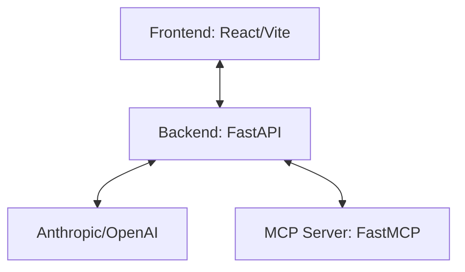

# Multi-Agent MCP System

A three-tier agentic system consisting of an MCP server, a FastAPI backend using LangChain/LangGraph, and a React frontend.

## Architecture



## Project Structure

- **[frontend](./frontend)**: React application providing the chat interface.
- **[backend](./backend)**: FastAPI server orchestrating the agent logic and MCP tool integration.
- **[mcp_server](./mcp_server)**: Model Context Protocol (MCP) server providing custom tools.

## Getting Started

### Prerequisites

- Python 3.14+
- [uv](https://github.com/astral-sh/uv) (Python package manager)
- Node.js & npm

### Running the System

To get the full system running, you need to start each component in a separate terminal:

1. **MCP Server**
   ```bash
   cd mcp_server
   uv run python main.py
   ```

2. **Backend**
   ```bash
   cd backend
   # Ensure .env is configured with your API keys
   uv run uvicorn main:app --reload
   ```

3. **Frontend**
   ```bash
   cd frontend
   npm install
   npm run dev
   ```

## Development

Detailed instructions for each component can be found in their respective directories.
